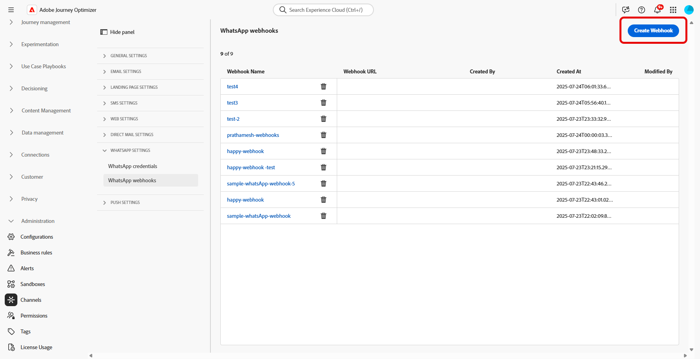

# WhatsApp 구성 시작 {#whatsapp-config}

WhatsApp 메시지를 보내기 전에 Adobe Journey Optimizer 환경을 구성하고 WhatsApp 계정과 연결해야 합니다. 다음을 수행하십시오.

1. [WhatsApp API 자격 증명 만들기](#WhatsApp-credentials)
1. [WhatsApp 웹후크 만들기](#WhatsApp-webhook)
1. [WhatsApp 구성 만들기](#WhatsApp-configuration)

이 단계는 Adobe Journey Optimizer [시스템 관리자](../start/path/administrator.md)가 수행해야 합니다.

## WhatsApp API 자격 증명 만들기 {#whatsapp-credentials}

1. 왼쪽 레일에서 **[!UICONTROL 관리]** `>` **[!UICONTROL 채널]**(으)로 이동한 다음 **[!UICONTROL API 자격 증명]** 메뉴를 선택하십시오. **[!UICONTROL 새 API 자격 증명 만들기]** 단추를 클릭합니다.

1. 아래에 자세히 설명된 대로 API 자격 증명을 구성합니다.

   * **API 토큰**: API 토큰을 입력하십시오. [메타 설명서](https://developers.facebook.com/blog/post/2022/12/05/auth-tokens/)에서 자세히 알아보기
   * **비즈니스 계정 ID**: 비즈니스 포트폴리오와 관련된 고유 번호를 입력하십시오. 자세한 내용은 [Meta 설명서](https://www.facebook.com/business/help/1181250022022158?id=180505742745347)를 참조하세요.

   

1. **[!UICONTROL 계속]**&#x200B;을 클릭합니다.

1. WhatsApp API 자격 증명에 연결할 **WhatsApp 비즈니스 계정**&#x200B;을(를) 선택하십시오.

   

1. Whatsapp 메시지를 보내는 데 사용되는 **보낸 사람 이름**&#x200B;을(를) 선택하십시오.

1. 전화 번호 설정이 자동으로 채워집니다.

   * **품질 평가**: 지난 24시간 동안 보낸 메시지에 대한 고객 피드백을 반영합니다.
      * 녹색: 고품질
      * 노란색: Medium 품질
      * 빨강: 낮은 품질

     [품질 평가](https://www.facebook.com/business/help/766346674749731#)에 대해 자세히 알아보기

   * **처리량**: 전화 번호에서 메시지를 보낼 수 있는 속도를 나타냅니다.

1. API 자격 증명 구성을 마치면 **[!UICONTROL 제출]**&#x200B;을 클릭합니다.

API 자격 증명을 만들고 구성한 후에는 WhatsApp 메시지에 대한 웹후크를 만들어야 합니다. [자세히 알아보기](#whatsapp-webhook)

## 웹후크 만들기 {#WhatsApp-webhook}

>[!CONTEXTUALHELP]
>id="ajo_admin_whatsapp_webhook_inbound_keyword_category"
>title="인바운드 키워드 카테고리"
>abstract="<b>옵트인</b>: 사용자가 구독하면 정의된 자동 응답이 전송됩니다.  <b>옵트아웃</b>: 사용자가 구독을 취소하면 정의된 자동 응답이 전송됩니다.  <b>도움말</b>: 사용자가 도움이나 지원을 요청하면 정의된 자동 응답을 보냅니다.  <b>기본값</b>: 키워드와 일치하는 항목이 없을 때 대체 자동 응답을 보냅니다."

>[!CONTEXTUALHELP]
>id="ajo_admin_whatsapp_webhook_inbound_keyword"
>title="키워드를 입력하십시오."
>abstract="사용자가 입력한 텍스트를 기반으로 특정 자동 응답을 트리거하는 키워드를 정의할 수 있습니다. 키워드는 대소문자를 구분하지 않습니다. 예를 들어 stop과 STOP은 동일하게 처리됩니다."

>[!CONTEXTUALHELP]
>id="ajo_admin_whatsapp_webhook_webhook_url"
>title="콜백 URL"
>abstract="이 오브젝트에 대한 유효성 검사 요청과 웹후크 알림은 지정된 URL로 전송됩니다."

>[!CONTEXTUALHELP]
>id="ajo_admin_whatsapp_webhook_verify_token"
>title="토큰 확인"
>abstract="검증 과정에서 콜백 URL을 확인하고 검증하기 위해 Meta가 다시 반향하는 토큰입니다."

>[!NOTE]
>
>지정된 옵트인 또는 옵트아웃 키워드가 없으면 표준 동의 메시지가 활성화되지 않습니다.

WhatsApp API 자격 증명이 정상적으로 생성되면 이제 옵트인 및 옵트아웃 동의 관리를 위한 인바운드 응답을 캡처하고, 사용 가능한 경우 읽기 확인을 포함한 게재 보고서를 수신하도록 웹후크를 구성할 수 있습니다.

1. 왼쪽 레일에서 **[!UICONTROL 관리]** `>` **[!UICONTROL 채널]**(으)로 이동하고 **[!UICONTROL WhatsApp 설정]**&#x200B;에서 **[!UICONTROL WhatsApp Webhooks]** 메뉴를 선택한 다음 **[!UICONTROL Webhook 만들기]** 단추를 클릭합니다.

   

1. Webhook의 **[!UICONTROL 이름]**&#x200B;을(를) 입력하십시오.

1. **[!UICONTROL 구성 선택]** 드롭다운에서 이전에 만든 [API 자격 증명](#whatsapp-credentials)을 선택합니다.

   

1. 다음과 같은 **[!UICONTROL 인바운드 키워드 범주]**&#x200B;을 선택합니다.

   * **[!UICONTROL 옵트인 키워드]**
   * **[!UICONTROL 옵트아웃 키워드]**
   * **[!UICONTROL 도움말 키워드]**

1. **[!UICONTROL 키워드]**&#x200B;를 입력하고 를 클릭하세요.

   

1. **[!UICONTROL 회신 메시지]** 필드에서 구성된 키워드를 받을 때 보낸 메시지를 입력하거나 드롭다운 메뉴에서 미리 정의된 옵션을 선택합니다.

   

<!--
1. Click **[!UICONTROL View payload editor]** to validate and customize your request payloads. 
    
    You can dynamically personalize your payload using profile attributes, and ensure accurate data is sent for processing and response generation with the help of built-in helper functions.
-->
1. 을(를) 추가하려면 **[!UICONTROL 추가]**&#x200B;를 클릭하십시오.

1. WhatsApp Webhook 구성을 마치면 **[!UICONTROL 제출]**&#x200B;을 클릭합니다.

1. **[!UICONTROL Webhooks]** 메뉴에서 을 클릭하여 WhatsApp Webhook를 삭제합니다.

   

1. 기존 구성을 수정하고 **[!UICONTROL Webhook URL]** 또는 **[!UICONTROL Webhook Verify toker]**&#x200B;에 액세스하려면 원하는 Webhook을 찾은 다음 **[!UICONTROL 편집]** 옵션을 클릭하여 필요한 내용을 변경하십시오.

1. 여기에 생성된 **[!UICONTROL Webhook Verify toker]**&#x200B;를 복사한 다음 Webhook 설정의 일부로 Meta 인터페이스에 붙여넣습니다.

   이 인증 토큰을 추가하는 방법과 위치에 대한 자세한 지침은 [메타 설명서](https://developers.facebook.com/docs/graph-api/webhooks/getting-started#configure-webhooks-product)를 참조하세요.

1. 이전에 제출한 **[!UICONTROL WhatsApp Webhook]**&#x200B;에서 새 **[!UICONTROL Webhook URL]**&#x200B;에 액세스하여 복사합니다.

   

이제 Webhook이 구성되었으므로 WhatsApp 구성을 만들 수 있습니다.

## WhatsApp 구성 만들기 {#whatsapp-configuration}

1. 왼쪽 레일에서 **[!UICONTROL 관리]** > **[!UICONTROL 채널]**(으)로 이동한 다음 **[!UICONTROL 일반 설정]** > **[!UICONTROL 채널 구성]**&#x200B;을 선택합니다. **[!UICONTROL 채널 구성 만들기]** 단추를 클릭합니다.

   

1. 구성의 이름 및 설명(선택 사항)을 입력한 다음 WhatsApp 채널을 선택합니다.

   >[!NOTE]
   >
   > 이름은 문자(A-Z)로 시작해야 합니다. 영숫자만 포함할 수 있습니다. 밑줄 `_`, 점 `.`, 하이픈 `-`도 사용할 수 있습니다.

1. **[!DNL WhatsApp]**&#x200B;을(를) 채널로 선택합니다.

   

1. 이 구성을 사용하여 동의 정책을 메시지에 연결하려면 **[!UICONTROL 마케팅 액션]**&#x200B;을 선택하세요. 마케팅 액션과 관련된 모든 동의 정책은 고객의 선호도를 존중하기 위해 활용됩니다. 자세히 알아보기

1. 이전에 만든 **[!UICONTROL WhatsApp API 구성]**&#x200B;을(를) 선택하십시오.

   

1. 통신에 사용할 **[!UICONTROL 발신자 이름]**&#x200B;을(를) 입력하십시오.

1. 모든 매개 변수가 구성되면 **[!UICONTROL 제출]**&#x200B;을 클릭하여 확인합니다. 채널 구성을 초안으로 저장하고 나중에 구성을 다시 시작할 수도 있습니다.

1. 채널 구성이 만들어지면 목록에 **[!UICONTROL 처리 중]** 상태로 표시됩니다.

   >[!NOTE]
   >
   >검사에 실패한 경우 [이 섹션](../configuration/channel-surfaces.md)에서 가능한 실패 이유에 대해 자세히 알아보세요.

1. 검사가 성공하면 채널 구성이 **[!UICONTROL 활성]** 상태가 됩니다. 메시지를 전달하는 데 사용할 준비가 되었습니다.

구성하고 나면 메시지 작성, 개인화, 링크 추적 및 보고와 같은 기본 제공 채널 기능을 모두 활용할 수 있습니다.

이제 Journey Optimizer에서 WhatsApp 메시지를 보낼 준비가 되었습니다.

## 사용 방법 비디오 {#video}

아래 비디오에서는 Adobe Journey Optimizer에서 WhatsApp 채널을 설정하는 방법을 보여 줍니다.

+++ 비디오 보기

>[!VIDEO](https://video.tv.adobe.com/v/3470268/?learn=on)

+++
